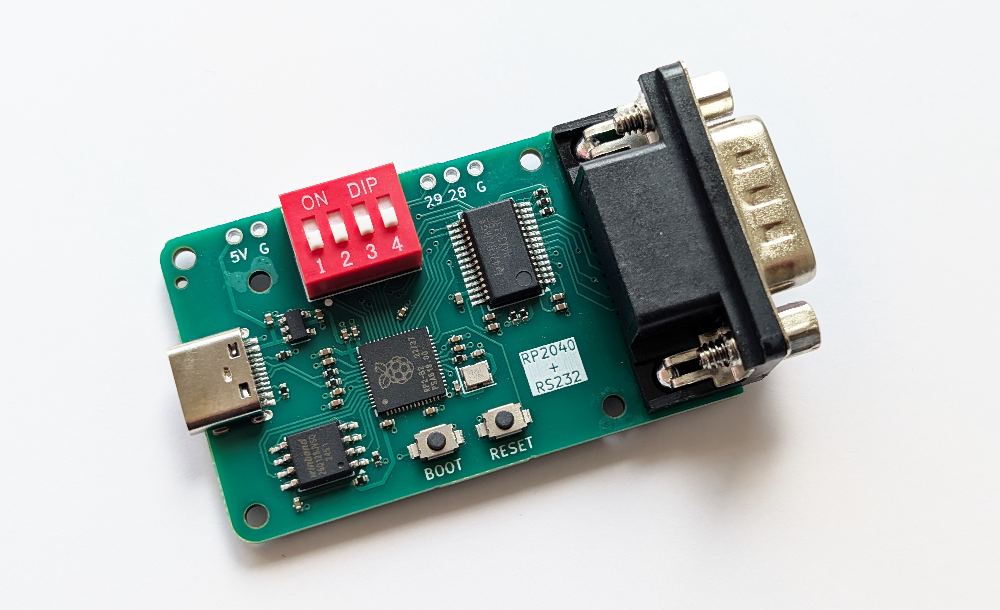

# RS-232 adapter with an RP2040 chip



This repository contains design files and firmware for a board that can be used as an RS-232 (serial) to USB adapter. It has an RP2040 chip for the application logic and a MAX3243 chip for the serial interface.

The provided firmware supports classic serial mice, two types of 3D mice (Magellan/SpaceMouse and Spaceball 2003), the SpaceOrb 360 game controller, and can also act as a generic serial-to-USB adapter.

## How to make the device

I used [JLCPCB](https://jlcpcb.com/) to make the board. The files in the [fabrication](fabrication) folder can be used with JLCPCB directly. If you want to use some other service, check the file formats that they expect. When ordering from JLCPCB, upload the Gerber zip, leave all the settings at default (you can choose the PCB color), then enable "PCB Assembly" and upload the BOM and CPL files in the next step.

Models for a 3D-printable case can be found in the [3d-printed-case](3d-printed-case) folder. The cases uses four M2x12 countersunk screws and (optionally) one M2x4 screw to secure the board to the case.

## Firmware

The provided firmware combines five separate projects and lets you choose between them using the DIP switches on the board. This way you can have a multi-purpose adapter without having to re-flash the firmware every time.

To flash the board with the firmware, press and hold the BOOT button, then while holding it press and release the RESET button. A drive named "RPI-RP2" should appear on your computer. Copy the [multi-firmware.uf2](https://github.com/jfedor2/rp2040-rs232/releases/latest/download/multi-firmware.uf2) file to that drive. After it's done flashing the drive will disappear and that's it.

project | description | DIP switch setting
------- | ----------- | ------------------
[HID Remapper](https://github.com/jfedor2/hid-remapper) | Adapts classic serial mice to USB | off-off-off-ON
[spaceball-2003](https://github.com/jfedor2/spaceball-2003) | Lets you use a Spaceball 2003 with modern software | off-off-ON-off
[magellan-spacemouse](https://github.com/jfedor2/magellan-spacemouse) | Lets you use a serial Magellan/SpaceMouse with modern software | off-off-ON-ON
[pico-uart-bridge](https://github.com/Noltari/pico-uart-bridge) | Generic USB-to-serial bridge | off-ON-off-off
[spaceorb360](https://github.com/jfedor2/spaceorb360)<br>(spacemouse) | Lets you use a SpaceOrb 360 with modern CAD software | off-ON-off-ON
[spaceorb360](https://github.com/jfedor2/spaceorb360)<br>(joystick) | Lets you use a SpaceOrb 360 with games like Descent | off-ON-ON-off

You can of course use any other firmware meant for the RP2040 chip if you want.

## How to compile

The easiest way to compile the firmware is to let GitHub do it for you. This repository has GitHub Actions that build the firmware, so you can just fork, enable Actions, make your changes, wait for the job to complete, and look for the binary in the artifacts produced.

To compile the firmware on your machine, use the following steps (details may vary depending on your Linux distribution):

```
sudo apt install gcc-arm-none-eabi libnewlib-arm-none-eabi libstdc++-arm-none-eabi-newlib
git clone https://github.com/jfedor2/rp2040-rs232.git
cd rp2040-rs232/multi-firmware
git submodule update --init
for submodule in hid-remapper magellan-spacemouse spaceball-2003 pico-uart-bridge
do
cd $submodule; git submodule update --init; cd ..
done
mkdir build
cd build
cmake ..
make
```

## License

The software in this repository is licensed under the [MIT License](LICENSE), unless stated otherwise. 

The hardware designs in this repository are licensed under the Creative Commons Attribution 4.0 International license ([CC BY 4.0](https://creativecommons.org/licenses/by/4.0/)), unless stated otherwise.

## Acknowledgments

PCB design uses [Type-C.pretty](https://github.com/ai03-2725/Type-C.pretty) library by [ai03-2725](https://github.com/ai03-2725).

Multi-firmware includes [pico-uart-bridge](https://github.com/Noltari/pico-uart-bridge) by [Noltari](https://github.com/Noltari).